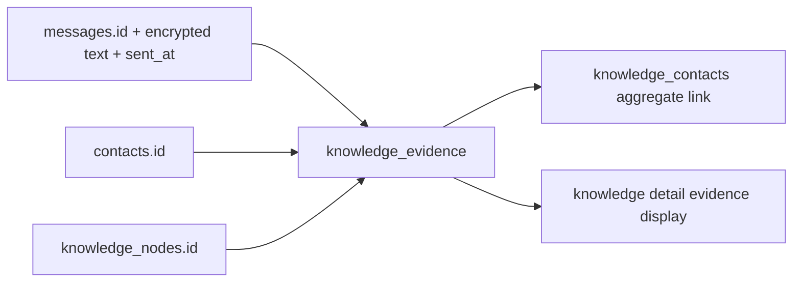
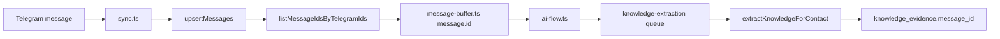

# Knowledge Graph Audit

Audit date: 2026-05-06 America/Denver
Branch audited: `feat/knowledge-graph`
Scope: static source audit plus repo validation commands. No feature code changes were made.

## 1. Executive Summary

- The feature today is an extracted entity graph, not a raw-message graph. Telegram messages are decrypted in worker jobs, masked, summarized into entity-like `knowledge_nodes`, linked to contacts in `knowledge_contacts`, and connected to other nodes in `knowledge_links`.
- The `/knowledge` page searches `knowledge_nodes`. It does not semantically search raw Telegram messages. Message-level semantic search exists separately through `apps/web/src/app/actions/search.ts` and the `memories` table.
- The visual graph is 2D. `apps/web/src/components/knowledge/knowledge-graph.tsx` dynamically imports `react-force-graph-2d`; `react-force-graph-3d` is installed but not wired into this feature.
- Node-to-node links are mostly generic `related_to` edges inferred by contact co-occurrence and embedding similarity. Typed relation enums exist, but the regular topic extraction path does not create evidence-backed typed topic edges.
- The current graph cannot answer "why is this edge here?" `knowledge_links` has no evidence/source/reason columns, and the UI does not expose supporting messages or inference metadata.
- Semantic indexing is inconsistent by surface: knowledge-node search masks queries before OpenAI embedding, chat `search_knowledge` masks queries before embedding, but the general `/search` action sends the raw query to the worker `/admin/embed` endpoint.
- Workspace scoping is present in most server actions and DAL calls, but database RLS is incomplete for `knowledge_contacts` and `knowledge_extraction_log`, and a few joins rely on FK integrity rather than explicitly constraining both joined tables by workspace.
- Tests cover many functions with mocks, but there is no repeatable graph-quality eval, live Postgres inference test, browser graph rendering test, or message-level retrieval test that verifies the intended product behavior.
- The highest-impact path is incremental: add evidence/provenance and eval coverage first, then add message-level retrieval, then clean up edge inference, then improve graph UX and optionally ship 3D.

## 2. Current Architecture Map

```mermaid
flowchart TD
  TG[Telegram MTProto sync] --> Sync[apps/worker/src/queues/sync.ts]
  Sync --> MsgDB[(messages.text encrypted)]
  Sync --> Private{private dialog?}
  Private -->|yes| Buffer[message-buffer.ts]
  Buffer --> AIPipe[ai-flow.ts scheduleAIPipeline]
  AIPipe --> MemJob[embeddings child job]
  AIPipe --> KGJob[knowledge-extraction child job]
  MemJob --> MaskMem[prefilterEntities + maskEntities]
  MaskMem --> MemEmbed[OpenAI text-embedding-3-small 512]
  MemEmbed --> Memories[(memories.content encrypted, content_sanitized, embedding)]
  KGJob --> Decrypt[withKeys decrypt messages]
  Decrypt --> KGPrefilter[keywordPreFilter]
  KGPrefilter --> KGEmbed[embeddingFirstMatch masked per-message embedding]
  KGPrefilter --> KGLlm[Gemini / batch Haiku entity extraction]
  KGEmbed --> KGNodeDAL[searchKnowledgeNodes / linkContactToKnowledge]
  KGLlm --> KGDedup[exact blind-index, alias, embedding dedup]
  KGDedup --> Nodes[(knowledge_nodes encrypted name/display/description, halfvec)]
  KGNodeDAL --> Contacts[(knowledge_contacts contact-node links)]
  KGLlm --> Log[(knowledge_extraction_log)]
  KGJob --> InferQ[knowledge-inference queue]
  InferQ --> Infer[runKnowledgeInference]
  Infer --> Cooccur[shared contact Jaccard]
  Infer --> Similar[inferSimilarityLinks embedding distance < 0.30]
  Cooccur --> Links[(knowledge_links)]
  Similar --> Links
  Nodes --> WebActions[apps/web/src/app/actions/knowledge.ts]
  Contacts --> WebActions
  Links --> WebActions
  WebActions --> Browser[knowledge-browser.tsx grid/search]
  WebActions --> Graph[knowledge-graph.tsx 2D canvas]
  WebActions --> Detail[knowledge/[id]/page.tsx detail + merge]
  Memories --> GeneralSearch[apps/web/src/app/actions/search.ts unifiedSearch]
  Nodes --> ChatTool[apps/worker/src/ai/chat-tools.ts search_knowledge]
  Links --> ChatTool
```

## 3. Source Inventory

| File path | Responsibility | Key functions/components | Risks/issues found | Suggested improvements |
| --- | --- | --- | --- | --- |
| `apps/web/src/app/(dashboard)/knowledge/page.tsx` | Server entry for `/knowledge` | `KnowledgePage`, `KnowledgeBrowserSection` | Loads top 50 nodes and enriches contact previews before client search. It is node-centric, not message-centric. | Add product copy/filters that make the searchable unit explicit. |
| `apps/web/src/app/(dashboard)/knowledge/knowledge-browser.tsx` | Client grid/search/graph switcher | `KnowledgeBrowser`, `fetchNodes` | Search calls `listKnowledgeNodesAction`; graph mode ignores active query/type filters. | Unify filters across grid and graph; show current search mode and empty states. |
| `apps/web/src/components/knowledge/knowledge-graph.tsx` | Knowledge graph visualization | `KnowledgeGraph`, `ForceGraph2D` | Uses 2D canvas only; no edge inspector, evidence, filters, clusters, pathfinding, or large graph controls. | Add inspector and filters before 3D; later add a real 3D toggle. |
| `apps/web/src/app/(dashboard)/knowledge/[id]/page.tsx` | Node detail page | `RelatedEntitiesSection`, `SharedKnowledgeSection`, merge candidates | Shows neighbors and contacts but not evidence snippets, source messages, or why links exist. | Add evidence panel and link provenance; improve similar-node detection. |
| `apps/web/src/components/knowledge/merge-dialog.tsx` | Manual node merge UI | `MergeDialog` | Merge is irreversible and does not explain edge/contact transfer consequences. | Add preview of aliases, contact links, and graph links before merge. |
| `apps/web/src/app/actions/knowledge.ts` | Server-action boundary for knowledge UI | `listKnowledgeNodesAction`, `getGraphDataAction`, `mergeKnowledgeNodesAction`, `generateQueryEmbedding` | `/knowledge` query embedding is masked, but search returns nodes only. Contact enrichment is N+1. | Add evidence retrieval action, similarity thresholding, and bulk contact preview query. |
| `apps/web/src/app/actions/search.ts` | General CRM search | `searchAction`, `getQueryEmbedding` | Sends raw query to worker `/admin/embed`; this differs from knowledge/chat masking. Searches `memories`, not knowledge graph. | Mask query before worker embedding or move embedding behind a masked worker endpoint. |
| `apps/worker/src/routes/admin.ts` | Internal worker admin utilities | `POST /admin/embed`, `POST /admin/extract-knowledge` | `/admin/embed` embeds supplied text as-is. It is internal-secret protected but not workspace-mask aware. | Require caller-provided workspace salt/envelope or a masked-text-only contract. |
| `packages/db/src/schema/knowledge.ts` | Knowledge schema | `knowledgeNodes`, `knowledgeContacts`, `knowledgeLinks`, `knowledgeExtractionLog` | Nodes are encrypted and embedded; links lack source/evidence/reason fields; aliases are plaintext `text[]`. | Add link provenance/evidence metadata; consider encrypted aliases or blind-indexed alias table. |
| `packages/db/src/dal/knowledge.ts` | Knowledge DAL and graph algorithms | `createKnowledgeNode`, `searchKnowledgeNodes`, `linkContactToKnowledge`, `mergeKnowledgeNodes`, `inferSimilarityLinks`, `knowledgeGraphSearch`, `provenanceSearch`, `getGraphData` | No similarity floor in search; stale links are only added/updated; some joins do not constrain joined nodes by workspace; N+1 inference and contact enrichment. | Add thresholds, explicit workspace joins, edge source fields, pruning/recompute jobs, and batch queries. |
| `packages/db/drizzle/0023_knowledge_nodes.sql` | Initial knowledge node/contact schema | `knowledge_nodes`, `knowledge_contacts`, HNSW | Original vector dimensions changed later; no evidence table. | Keep migration docs updated with current halfvec(512) state. |
| `packages/db/drizzle/0024_knowledge_links.sql` | Knowledge edge schema | `knowledge_links` | No evidence/source/reason fields; link type enums exist but generic usage dominates. | Add provenance columns and/or edge evidence table. |
| `packages/db/drizzle/0035_knowledge_aliases.sql` | Merge alias support | `aliases text[]` | Stores aliases in plaintext. | Encrypt or blind-index aliases if project/topic names are sensitive. |
| `packages/db/drizzle/0036_decision_provenance.sql` | Adds decision/rationale/outcome nodes | enum extensions, metadata GIN | Reuses knowledge graph for decision provenance, mixing product concepts and topic graph. | Separate UI facets or filter provenance node types by default. |
| `packages/db/drizzle/0042_vector_512.sql` | Migrates embeddings to `halfvec(512)` | HNSW index, `hybrid_search` | Architecture docs still mention 1536 dims in places. | Update docs and add migration note for re-embedding assumptions. |
| `packages/db/drizzle/0053_rls_workspace_isolation.sql` | RLS hardening | policies for several tables | TODO explicitly leaves `knowledge_contacts` and `knowledge_extraction_log` without RLS. | Add RLS policies and regression tests for those tables. |
| `apps/worker/src/queues/sync.ts` | Telegram message ingestion | `syncContactsForAccount`, message buffering | Normal AI pipeline is scheduled for private dialogs only; group messages may not feed knowledge extraction. | Decide and document intended group-message KG behavior; add safe synthetic tests. |
| `apps/worker/src/queues/message-buffer.ts` | Debounced AI pipeline scheduling | `bufferMessage`, `flushBuffer`, `flushAllBuffers` | Buffers private-contact messages only from current sync path. | Add per-source counters so graph freshness is observable. |
| `apps/worker/src/queues/ai-flow.ts` | AI parent pipeline | `scheduleAIPipeline`, embeddings child, knowledge child | Knowledge extraction is one child among many; failures are non-fatal and can be hidden. | Emit structured KG extraction metrics per workspace/contact. |
| `apps/worker/src/queues/knowledge-extraction.ts` | BullMQ worker for KG extraction | `knowledgeExtractionWorker` | Requires `workspaceSalt` and `keyEnvelope`; schedules inference with job id `infer-${workspaceId}`, different from helper `ki-${workspaceId}`. | Standardize inference debounce job IDs and log skipped reasons. |
| `apps/worker/src/ai/knowledge-extraction.ts` | Entity extraction and contact linking | `keywordPreFilter`, `embeddingFirstMatch`, `llmExtractEntities`, `extractKnowledgeEntities`, `extractKnowledgeForContact` | Keyword prefilter can miss CRM topics; staleness check is ineffective; caps entities at 10; no message evidence stored. | Add evidence capture, stronger stale horizon, eval dataset, and prompt/schema tests. |
| `apps/worker/src/ai/batch-relationship.ts` | Batch LLM extraction | `BatchRelationshipExtractor`, `processEntities` | Mirrors LLM entity path but still creates only node/contact links and no evidence-backed node edges. | Use batch output to generate typed node-node candidate edges with evidence. |
| `apps/worker/src/ai/knowledge-inference.ts` | Offline edge inference | `runKnowledgeInference` | Creates generic `related_to` edges from shared contacts and similarity; N+1 contact loading; only adds/updates. | Recompute edge table from source signals or store source-specific edge records. |
| `apps/worker/src/queues/knowledge-cron.ts` | Nightly extraction cron | `runNightlyExtraction`, `processWorkspace`, `scheduleNightlyExtraction` | Runs every 24h; batch scheduling is coarse; graph inference is tied to extraction results. | Add explicit freshness metrics and backfill controls. |
| `apps/worker/src/ai/chat-tools.ts` | AI chat graph tool | `SEARCH_KNOWLEDGE_TOOL`, `executeSearchKnowledge` | `search_knowledge` searches knowledge/provenance nodes and graph traversal, not raw messages. Output is text/JSON without evidence snippets. | Add message evidence retrieval and cite source contacts/timestamps. |
| `packages/db/src/schema/memories.ts` and `packages/db/src/dal/memories.ts` | Message/memory semantic search | `memories`, `hybridSearch`, `textSearch` | This is the closest current message-level semantic layer, but it is separate from `/knowledge`. | Integrate memory hits as evidence for KG nodes and search results. |
| `README.md`, `ARCHITECTURE.md`, `docs/CODEBASE_MAP.md`, `docs/ENVIRONMENT_MATRIX.md` | Project docs and setup | local demo, embedding/security docs | Docs do not accurately describe current KG behavior; some architecture sections still cite 1536-dim vectors. `docs/BUILDING_TELEGRAM_CRMS.md` is missing. | Add current-state KG docs and update embedding dimension references. |

## 4. Actual Behavior vs Intended Behavior

Intended feature: "semantically search your messages and make links between topics in a 3D manner."

| Capability | Status | Actual behavior | Evidence |
| --- | --- | --- | --- |
| Extract topics/entities from Telegram messages | Implemented | Worker decrypts messages, prefilters, masks, uses embedding-first matching and LLM extraction to create/link knowledge nodes. | `apps/worker/src/ai/knowledge-extraction.ts`, `apps/worker/src/queues/knowledge-extraction.ts` |
| Use contacts as graph context | Implemented | `knowledge_contacts` links contacts to nodes with relation type, strength, evidence count, and last evidence timestamp. | `packages/db/src/schema/knowledge.ts`, `linkContactToKnowledge` |
| Semantically search raw messages in the KG feature | Not implemented | `/knowledge` searches extracted `knowledge_nodes`; raw/sanitized message search is in separate `unifiedSearch` over `memories`. | `listKnowledgeNodesAction`, `searchKnowledgeNodes`, `unifiedSearch` |
| Semantically search extracted knowledge nodes | Implemented | Masked query embedding is compared to `knowledge_nodes.embedding` with HNSW/halfvec. | `apps/web/src/app/actions/knowledge.ts`, `packages/db/src/dal/knowledge.ts` |
| Search with raw-message evidence snippets | Not implemented | Search returns nodes/contact previews; no message evidence table or action is queried. | `knowledge_nodes`, `knowledge_contacts`, `knowledge_links` schemas |
| Link related topics | Partially implemented | Edges are inferred from shared contacts and embedding similarity; typed topic relation extraction is not part of normal entity extraction. | `runKnowledgeInference`, `inferSimilarityLinks` |
| Explain why topics are linked | Not implemented | `knowledge_links` stores source/target/type/weight only. | `packages/db/src/schema/knowledge.ts` |
| Display graph | Implemented | Canvas force graph renders top nodes and links. | `KnowledgeGraph` |
| Display graph in 3D | Not implemented | Uses `react-force-graph-2d`; no `react-force-graph-3d` import in knowledge UI. | `apps/web/src/components/knowledge/knowledge-graph.tsx` |
| Node details | Partially implemented | Shows description, mention count, contacts, related entities, shared contact context, and merge UI. | `knowledge/[id]/page.tsx` |
| Merge duplicates | Partially implemented | Manual merge transfers contacts and links, updates aliases/mention count, deletes merged node. | `mergeKnowledgeNodes`, `merge-dialog.tsx` |
| Runtime large-graph degradation | Unclear / needs runtime verification | Graph caps at 200 nodes by default, but no browser rendering benchmark was run because demo smoke failed before app login. | `getGraphDataAction({ maxNodes: 200 })` |

## 5. Stage-by-Stage Data Flow Audit

| Stage | Source files/functions | Inputs | Outputs/tables | Security/privacy handling | Failure modes and observability | Tests and limits |
| --- | --- | --- | --- | --- | --- | --- |
| Message ingestion | `apps/worker/src/queues/sync.ts`, `packages/db/src/dal/messages.ts` | Telegram dialogs/messages from GramJS | `messages` encrypted rows; buffered AI messages for private dialogs | Message text encrypted with workspace envelope; Telegram disabled by default per README/docs | Sync logs and counters exist; normal AI path only triggers for private dialogs | Tests cover sync/Telegram pieces, but no KG group-message ingestion eval |
| Message memory embedding | `apps/worker/src/queues/ai-flow.ts`, `apps/worker/src/ai/embeddings.ts`, `packages/db/src/dal/memories.ts` | Message text batches | `memories.content` encrypted, `content_sanitized`, `embedding halfvec(512)` | `prefilterEntities` and `maskEntities` before embedding in worker queue | Individual embedding failures are logged; memories can remain unembedded | DB/memory/search tests exist; not tied to KG UI |
| Knowledge extraction job | `apps/worker/src/queues/knowledge-extraction.ts` | Encrypted BullMQ payload containing workspace/contact/messages/envelope | Calls extraction and schedules inference | Requires workspace salt and key envelope; decrypts inside `withKeys` | Skips missing salt/envelope/feature flag; errors logged and rethrown for job retry | `knowledge-flow.test.ts` covers scheduling/gating |
| Entity extraction | `apps/worker/src/ai/knowledge-extraction.ts`, `batch-relationship.ts` | Decrypted contact messages | Entity candidates, contact-node links, extraction log | Messages and embedding inputs are masked before LLM/embedding calls | Keyword prefilter can skip entire contacts; staleness check is not reliable; JSON parse/LLM failures return empty | `knowledge-extraction.test.ts`; missing precision/recall eval |
| Node creation/dedup | `packages/db/src/dal/knowledge.ts` | Entity name/type/description/embedding | `knowledge_nodes` | Name/display/description encrypted; exact blind index for name; embeddings over masked inputs | Conflict increments mention count but does not refresh stale descriptions or embeddings | DAL tests cover create/search; no live vector-quality eval |
| Contact-node links | `linkContactToKnowledge` | Node/contact/relation/strength | `knowledge_contacts` | Workspace id stored and queried | Upsert increments evidence count but stores no evidence snippets/message ids | DAL tests cover linking; RLS migration omits this table |
| Node-node links | `runKnowledgeInference`, `inferSimilarityLinks`, `createKnowledgeLink` | Nodes, contact sets, embeddings | `knowledge_links` | Workspace id stored and queried | Only adds/updates; no stale-link pruning; direction arbitrary for inferred `related_to` edges | `knowledge-inference.test.ts`; no live graph reconstruction test |
| Graph data query | `getGraphData`, `getGraphDataAction` | Workspace and max nodes | Nodes/links for graph UI | Server action derives workspace from session, not client | Top mention-count nodes can hide low-mention bridges; no pagination | Action tests mock DAL |
| Frontend rendering | `knowledge-browser.tsx`, `knowledge-graph.tsx` | Graph JSON | 2D canvas graph, grid cards | Client receives node names/descriptions/contact previews, not embeddings | No evidence/edge inspector; max 200 nodes; no runtime benchmark completed | No browser rendering test for KG graph |
| Detail and merge | `knowledge/[id]/page.tsx`, `merge-dialog.tsx`, `mergeKnowledgeNodes` | Node id, optional source contact id, merge ids | Detail page, merged node, transferred links | Server action validates UUID and workspace ownership | Merge is irreversible; no preview of link/evidence consequences; aliases plaintext | Action/DAL tests cover some BOLA and merge paths |
| Chat graph search | `apps/worker/src/ai/chat-tools.ts`, `provenanceSearch`, `knowledgeGraphSearch` | User chat query and workspace envelope | Text/JSON graph context | Query is masked before embedding in chat tool | Returns graph nodes/related nodes, not source messages; traversal is mainly node graph | Chat-tool tests cover masking; no answer-quality eval |

## 6. Semantic Search Audit

### What Is Indexed

- `knowledge_nodes.embedding`: `halfvec(512)` built from masked entity composites such as type, display/name, and context in `knowledge-extraction.ts` and `batch-relationship.ts`.
- `memories.embedding`: `halfvec(512)` built from masked message text in the AI pipeline. `memories.content` is encrypted; `content_sanitized` is plaintext masked content for fallback text search.
- `commitments.embedding`, `outcomes.embedding`, and decision/provenance embeddings exist in adjacent systems and can appear in chat/search contexts.

### What Is Searched

- `/knowledge` search searches `knowledge_nodes`. If embedding generation succeeds, `searchKnowledgeNodes` orders by vector distance. If embedding generation fails, it falls back to exact blind-index lookup on node name.
- `/search` searches contacts, memories, commitments, and deals through `unifiedSearch`. This is the actual message/memory semantic search path, but it is not the knowledge graph page.
- AI chat `search_knowledge` first runs `provenanceSearch` over knowledge/provenance nodes with a masked query embedding, then falls back to exact node-name search and graph traversal.

### Embedding Model and Dimensions

- Current code uses OpenAI `text-embedding-3-small` with `dimensions: 512`.
- Database custom type is `halfvec(512)`.
- `ARCHITECTURE.md` still contains older 1536-dimension examples and should be updated.

### Masking and Encryption Effects

- Knowledge extraction masks message/entity inputs before LLM and embedding calls.
- `/knowledge` masks the query before embedding.
- Chat tool knowledge search masks the query before embedding.
- General `/search` sends raw query text from `apps/web/src/app/actions/search.ts` to `apps/worker/src/routes/admin.ts` `/admin/embed`, which embeds text as supplied. This is an inconsistency with the embedding security model.
- Embeddings are stored plaintext vectors. The architecture correctly treats embeddings as sensitive, but masking quality and provider contracts matter because vectors can leak semantic content.

### Search Quality Risks

- `searchKnowledgeNodes` has no similarity floor in the vector path, so an unrelated query can return the nearest nodes anyway.
- Text fallback is exact blind-index lookup only. That is appropriate for encrypted fields, but it means fuzzy/substring search only works if embeddings are available.
- Knowledge search returns nodes, not message chunks, so it cannot prove a result with the original conversation context.
- Entity-level embeddings can be too coarse. Searching "who talked about a partnership with X last week?" requires time/contact/message retrieval, not just node similarity.
- Query embedding and node embedding inputs are not identical distributions: queries are free text, nodes are composite entity descriptions.

### Recommendations

1. Add a message-chunk retrieval layer for KG search. Use `memories` or a new `message_chunks` table to return source contacts, timestamps, and snippets alongside nodes.
2. Add hybrid ranking for knowledge search: vector distance, exact/blind-index match, alias match, mention recency, contact overlap, and optional memory evidence count.
3. Add a minimum similarity threshold and "no confident results" behavior for knowledge-node vector search.
4. Mask general `/search` queries before `/admin/embed`, or replace `/admin/embed` with a workspace-aware masked embedding endpoint.
5. Add retrieval evals with fixed queries and expected nodes/messages, including negative queries that should return no result.

## 7. Graph Construction Audit

### Node Types

`knowledgeNodeTypeEnum` contains:

- Product/topic entities: `topic`, `project`, `organization`, `technology`, `sector`, `concept`.
- Provenance entities: `rationale`, `decision`, `outcome`.

The current user-facing graph mixes these unless callers filter by type. That can be useful, but it also blends "knowledge about the network" with "decision provenance" in one graph surface.

### Contact Relation Types

`knowledgeContactRelTypeEnum` includes `knows_about`, `works_on`, `member_of`, `expert_in`, `uses`, `invested_in`, `interested_in`, `decided`, and `experienced_outcome`.

Most topic extraction links use the LLM-provided relation type and confidence. Embedding-first matching links contacts as `knows_about`.

### Link Types

`knowledgeLinkTypeEnum` includes `part_of`, `related_to`, `competes_with`, `builds_on`, `funds`, `uses`, `cites`, `led_to`, `preceded_by`, and `contradicts`.

In the regular knowledge mesh path, `knowledge-inference.ts` and `inferSimilarityLinks` create `related_to` edges. Rationale/provenance paths create `cites` and `led_to`. There is no regular LLM extraction path that emits evidence-backed `part_of`, `competes_with`, `builds_on`, `funds`, or `uses` links between topic nodes.

### Edge Creation Strategies

- Contact co-occurrence: `runKnowledgeInference` builds node-contact sets, creates `related_to` when two nodes share at least 2 contacts and Jaccard weight is at least 0.05.
- Embedding similarity: `inferSimilarityLinks` creates `related_to` links for node pairs in the same workspace where cosine distance is below `0.3` (similarity above about `0.7`).
- Decision provenance: `rationale-extraction.ts` creates decision-to-rationale `cites` links and rationale-to-entity `cites` links; `outcome-evaluators.ts` creates decision-to-outcome `led_to` links.
- Manual links: no general UI for manually creating or correcting node-node edges was found.

### Thresholds and Weight Semantics

- Embedding-first contact match: similarity must exceed `0.8`.
- LLM entity acceptance: confidence must be at least `0.7`; maximum 10 entities per LLM extraction.
- Entity semantic dedup: nearest node can be reused above roughly `0.75` similarity.
- Similarity edge inference: distance below `0.3`.
- Co-occurrence edge inference: shared contacts at least 2 and Jaccard weight at least `0.05`.

Weights are not normalized across sources. A Jaccard score, embedding similarity, LLM confidence, and outcome ROI weight are different signals but share the same `weight` column and similar UI treatment.

### Deduplication and Merge Behavior

- Exact dedup uses `(workspace_id, name_blind_index, type)` on insert.
- Alias dedup checks plaintext aliases.
- Semantic dedup searches existing node embeddings.
- Manual merge transfers contact links and non-conflicting source/target links, increments mention count, stores aliases, deletes the merged node.

Risks:

- `createKnowledgeNode` conflict increments mention count but does not update stale descriptions, display names, aliases, or embeddings when later evidence is better.
- `createKnowledgeLink` does not prevent self-links and overwrites weight on conflict; `inferSimilarityLinks` uses `GREATEST`.
- Merge can preserve the graph structurally, but without edge evidence it cannot recompute whether transferred edges remain semantically valid.

### Staleness and Noise Risks

- Link inference only adds or strengthens links. There is no regular pruning/recompute path for links that become stale or are later contradicted by better evidence.
- Generic topics can become hubs. The co-occurrence Jaccard threshold helps, but there is no stoplist, inverse-document-frequency penalty, degree cap, or cluster-aware layout.
- Direction is arbitrary for inferred `related_to` edges because node IDs determine source/target. Direction should not be presented as semantically meaningful for those links.

### Graph Recommendations

1. Add `source`, `reason`, `evidence`, `last_computed_at`, and `expires_at` or `generation_id` to edge records.
2. Split edge sources: `llm_extracted`, `co_occurrence`, `embedding_similarity`, `manual`, `provenance`.
3. Recompute inferred edges offline into a fresh generation, then swap or prune stale edges.
4. Add a generic-topic suppression layer using a stoplist, degree cap, and IDF-like penalty.
5. Add LLM relation extraction for node-node edges only when evidence snippets and confidence are stored.

## 8. UI/UX Audit

### 2D vs 3D Status

The knowledge graph is 2D today. `KnowledgeGraph` uses `react-force-graph-2d` and canvas drawing callbacks. No current knowledge graph component imports `react-force-graph-3d`.

### Current Controls

- Grid vs graph toggle in `KnowledgeBrowser`.
- Type filter tabs for grid/search.
- Search box for node search.
- Graph legend by node type.
- Click a graph node to navigate to `/knowledge/[id]`.
- Detail page shows related entities, shared knowledge with source contact, linked contacts, and merge candidates.

### Missing Graph Affordances

- No 3D rendering, camera controls, or 2D/3D toggle.
- No edge inspector or "why linked" explanation.
- No supporting messages/evidence snippets.
- No filters by contact, date, source, relation type, edge source, confidence, or recency.
- No neighbor expansion, shortest path, path explanation, saved views, or community/cluster labels.
- No edge labels in the graph view.
- No graph minimap or level-of-detail behavior.
- No clear handling for graph sizes beyond the top 200 mention-count nodes.
- No user correction workflow for bad nodes/edges besides node merge.

### Accessibility and Usability

- Canvas-only node labels are not accessible to screen readers.
- Color encodes type, but there is no non-color encoding in the graph itself.
- Link color is constant, so relation type is not visually discoverable.
- Dense labels can overlap at scale.
- Graph mode does not reflect the active grid filters, which can surprise users.

### Recommended 3D Roadmap

1. First add evidence and inspection in 2D. A 3D graph without explainability will look better but remain hard to trust.
2. Add filters and neighborhood expansion so the graph is navigable before increasing visual complexity.
3. Add a 3D mode using `react-force-graph-3d` only after graph data includes edge provenance and the UI can bound node counts.
4. Use 3D for exploratory spatial navigation, not as the only graph view. Keep 2D/table/detail views for accessibility and precision.
5. Add layout presets: contact-centric, topic-centric, recent activity, and decision provenance.

## 9. Data Quality and Evaluation Plan

### Likely Data Quality Issues

- False negatives from `KNOWLEDGE_KEYWORDS`, especially personal CRM topics that are not crypto/business keywords.
- False positives from generic project/sector words that appear frequently.
- Duplicate nodes when aliases or spelling variants differ and embedding similarity is below threshold.
- Over-merged nodes when similar terms have different meanings in different communities.
- Weak relation labels because topic-topic relation extraction is not evidence-backed.
- Missing source timestamps and snippets make it impossible to audit bad extraction.

### Synthetic Dataset

Create a deterministic seed fixture with 8 contacts and 80 to 120 messages:

- Contact A: discusses Solana DePIN infrastructure and Helium.
- Contact B: discusses Solana DePIN but from an investor angle.
- Contact C: discusses Ethereum L2 developer tooling, unrelated to DePIN.
- Contact D: mentions "Base" as Coinbase L2 and "base case" in a non-crypto sentence to test ambiguity.
- Contact E: discusses AI agents for customer support and CRM automation.
- Contact F: discusses a company named "Graphite" and a generic "knowledge graph" topic to test organization vs concept extraction.
- Contact G: group-chat-like messages with multiple people and topic drift.
- Contact H: sensitive personal details that should be masked and not become nodes.

Expected graph:

- Nodes: Solana, DePIN, Helium, Ethereum L2, Base, AI agents, CRM automation, knowledge graph, Graphite.
- Edges: Solana related to DePIN and Helium with evidence; AI agents related to CRM automation; Graphite separate from knowledge graph unless a message explicitly links them.
- Negative cases: no nodes for phone numbers, personal names, throwaway dates, or generic filler.

### Metrics

- Entity extraction precision and recall against labeled entities.
- Duplicate node rate by canonical topic.
- Edge precision: percent of edges with correct relation and evidence.
- Search relevance: MRR/NDCG for fixed queries over nodes and message evidence.
- Graph usefulness: percentage of top edges with actionable contact/topic explanation.
- Latency: extraction time per 100 messages, graph query time, search time, browser render time.
- Privacy: percent of generated nodes/aliases/snippets containing unmasked PII.

### CI Evals

- Unit eval: run extraction prompt against synthetic messages with mocked LLM output and verify schema filtering/dedup.
- DAL eval: use a live test Postgres with pgvector to test search thresholds, inference, RLS, and pruning.
- UI eval: render knowledge graph with deterministic graph data in Playwright and verify labels, click behavior, empty state, and filter behavior.
- Retrieval eval: fixed query set with expected node ids and expected evidence snippets.
- Privacy eval: assert no raw phone/email/usernames are embedded or returned in client graph/search payloads.

## 10. Security and Privacy Audit

### Workspace Isolation

- Server actions use `workspaceAction`, so the client does not provide trusted workspace ids for normal knowledge UI calls.
- DAL functions generally filter by `workspaceId`.
- Some joins should be tightened to explicitly constrain both joined tables by workspace, notably `listKnowledgeByContact` and `getKnowledgeNeighbors`.
- Migration `0053_rls_workspace_isolation.sql` leaves `knowledge_contacts` and `knowledge_extraction_log` without RLS, even though both tables carry workspace-scoped relationship metadata.

### Encrypted Fields and Blind Indexes

- `knowledge_nodes.name`, `display_name`, and `description` use encrypted text.
- `nameBlindIndex` supports exact name lookup under encryption.
- Messages and memory raw content are encrypted.
- `memories.content_sanitized` is plaintext masked content and should be treated as sensitive.
- `knowledge_nodes.aliases` is plaintext `text[]`, which can leak sensitive project/topic labels if DB read access is compromised.

### Embedding Privacy Risks

- Embeddings are not encrypted. The architecture correctly notes inversion risk, so masking is mandatory.
- Knowledge extraction and knowledge-page search mask before embedding.
- General `/search` currently sends raw query text to `/admin/embed`, which embeds it as supplied. That violates the spirit of the embedding security model for user queries.
- Provider-side exposure remains relevant; use ZDR contracts where available and minimize raw text reaching embedding APIs.

### Client Data Exposure

- Graph data does not include embeddings.
- Graph data includes decrypted node names/display names/descriptions and link types/weights. That is expected for an authenticated workspace user, but it means any BOLA flaw would leak sensitive relationship intelligence.
- Contact previews include names but not messages; no snippets are currently exposed.
- Inferred relationships without evidence can mislead users and create privacy-sensitive claims about contacts' interests or affiliations.

### Telegram-Specific Risks

- The open-source posture disables Telegram by default, which is appropriate.
- Saved MTProto sessions remain high risk outside demo mode.
- Knowledge extraction can summarize sensitive Telegram content into durable graph nodes. Even if raw messages are encrypted, extracted node labels and embeddings may leak sensitive topics.
- Group-chat knowledge extraction behavior is not clearly documented; private dialogs appear to be the normal pipeline source.

### Security Recommendations

1. Add RLS policies for `knowledge_contacts` and `knowledge_extraction_log`.
2. Tighten workspace predicates on all joins touching knowledge tables.
3. Mask `/search` queries before embedding and add tests for that exact path.
4. Encrypt or normalize aliases through a separate blind-indexed alias table.
5. Add a privacy eval that fails if raw phone numbers, emails, usernames, or personal names become node names, aliases, snippets, or embedding inputs.

## 11. Performance Audit

### Query and Index Risks

- `knowledge_nodes.embedding` has an HNSW index after migration `0042_vector_512.sql`; vector search wraps `hnsw.iterative_scan = relaxed_order`, which is good for filtered vector recall.
- `getGraphData` selects top nodes by mention count and then links among those nodes. This is simple but can omit important bridge nodes and can bias toward noisy hubs.
- `listKnowledgeNodesAction` enriches nodes with contact previews through per-node contact lookups, creating N+1 behavior.
- `runKnowledgeInference` loads up to 5000 nodes, then calls `listContactIdsByKnowledge` per node. That is N+1 and will degrade as node count grows.
- Recursive graph traversal has no sophisticated path bounding beyond max hops and no edge-source/weight filters.

### Scale Estimates

- 100 messages: current pipeline should be fine; LLM/entity caps may under-extract if the batch contains many topics.
- 1k messages: cron/backfill and memory embeddings likely work, but graph quality depends heavily on dedup and evidence tracking.
- 10k messages: extraction costs and duplicate/noisy nodes become significant; N+1 inference and contact enrichment become visible.
- 100k messages: a chunk/evidence retrieval layer, backpressure, metrics, and offline recompute are required. Current graph edge inference will need batching and incremental recompute.
- 100 nodes: 2D graph is fine.
- 1k nodes: current graph fetch cap hides most nodes; if raised, labels and canvas clutter become a problem.
- 10k nodes: client graph must use filtered neighborhoods, server-side aggregation, or cluster summaries; rendering all nodes is not viable.

### Queue and Cron Bottlenecks

- Nightly extraction runs every 24h and uses a global LLM budget.
- Inference is scheduled after extraction, but job IDs differ between the worker and helper (`infer-${workspaceId}` vs `ki-${workspaceId}`), which weakens predictable debounce behavior.
- There is no graph-freshness dashboard showing extraction lag, unembedded nodes, stale edges, or failed inference jobs.

### Recommended Instrumentation

- Counters: messages considered, messages skipped by prefilter, embedding matches, LLM entities, nodes created, nodes reused, contacts linked, edges created by source, edges pruned.
- Histograms: extraction latency per contact, embedding latency, LLM latency, search latency, graph query latency, graph render time.
- Gauges: nodes per workspace, links per workspace, average degree, top-degree nodes, percent nodes with evidence, percent links with evidence.
- Logs: structured job ID, workspace ID prefix, contact ID prefix, feature flag state, skip reason, retry count.

## 12. Existing Tests and Validation

### Relevant Tests Found

- `apps/web/src/__tests__/actions/knowledge.test.ts`: server action tests for list/search/get/neighbors/shared/merge/graph data.
- `apps/web/src/__tests__/knowledge-search-embedding.test.ts`: query masking and embedding shape tests for knowledge search.
- `packages/db/src/__tests__/knowledge.test.ts`: DAL tests for create/list/link/merge/link/neighbors/shared/traversal.
- `packages/db/src/dal/__tests__/knowledge-search-verify.test.ts`: search path and iterative scan behavior.
- `packages/db/src/dal/__tests__/knowledge-iterative-scan.test.ts`: HNSW iterative scan setup.
- `packages/db/src/dal/__tests__/provenance-search.test.ts`: provenance search behavior.
- `apps/worker/src/ai/__tests__/knowledge-extraction.test.ts`: keyword prefilter, masking, extraction, embedding-first behavior.
- `apps/worker/src/ai/__tests__/knowledge-inference.test.ts`: feature flag, co-occurrence threshold, similarity threshold.
- `apps/worker/src/queues/__tests__/knowledge-flow.test.ts`: AI pipeline knowledge-extraction child.
- `apps/worker/src/queues/__tests__/knowledge-cron.test.ts`: nightly/batch extraction behavior.
- `apps/worker/src/ai/__tests__/chat-tools-trace.test.ts` and related chat tests: query masking and tool behavior.

### Gaps

- No graph-quality eval against labeled synthetic data.
- No live pgvector integration test that verifies vector thresholds and HNSW behavior with real Postgres.
- No browser/UI test for the actual knowledge graph component.
- No evidence-snippet tests because evidence is not stored.
- No test proving `/knowledge` search can retrieve raw messages, because it cannot.
- No test for stale edge pruning or edge recomputation.
- No RLS test for `knowledge_contacts` or `knowledge_extraction_log`.
- No test catching raw `/search` query embedding through `/admin/embed`.

### Validation Commands Run

| Command | Result | Notes |
| --- | --- | --- |
| `pnpm lint` | Passed with warnings | Exit code 0. Biome reported 140 warnings, mostly existing forbidden non-null assertions in scripts/tests/worker code. |
| `pnpm typecheck` | Passed | Turbo reported 8 successful tasks, all cached. |
| `pnpm test` | Passed | Turbo reported 8 successful tasks, all cached. Output included expected mocked error logs and Redis `EPERM` noise from a worker queue test, but the command exited 0. |
| `pnpm demo:smoke` | Failed in local environment | Sandboxed run failed because `tsx` could not create an IPC pipe. Unsandboxed rerun reached Playwright but failed demo login because the local demo database connection was refused. Run `pnpm demo:setup` first, then retry. |
| `pnpm audit:open-source` | Not supported | Root package has no `audit:open-source` script; pnpm returned `Command "audit:open-source" not found`. |

## 13. Improvement Backlog

### Quick Wins: 1 Day or Less

| Title | Problem | Proposed fix | Expected impact | Complexity | Files likely touched | Tests needed | Risk |
| --- | --- | --- | --- | --- | --- | --- | --- |
| Clarify KG search unit | Users can assume `/knowledge` searches raw messages. | Update UI/docs to say it searches extracted topics/entities and link to general search for message hits. | Prevents product misinterpretation. | Low | `knowledge-browser.tsx`, docs | Snapshot/action test if UI text changes | Low |
| Add search similarity floor | Vector search can return irrelevant nearest nodes. | Add configurable minimum similarity and empty-state result metadata. | Better trust and fewer false positives. | Low | `packages/db/src/dal/knowledge.ts`, action tests | DAL search tests with negative query | Medium |
| Tighten workspace joins | Some DAL joins rely on FK/RLS instead of explicit node workspace filters. | Add joined-table workspace predicates. | Better BOLA defense-in-depth. | Low | `packages/db/src/dal/knowledge.ts` | DAL tests for cross-workspace fixtures | Low |
| Standardize inference job IDs | Two inference enqueue paths use different job IDs. | Use one helper/constant for workspace inference debounce. | More predictable queue behavior. | Low | `knowledge-extraction.ts`, `knowledge-inference.ts` | Queue unit tests | Low |
| Document current 2D status | Product direction says 3D but implementation is 2D. | Add explicit current-state note and roadmap in docs. | Aligns expectations. | Low | docs | None beyond markdown review | Low |

### Short-Term: 2 to 5 Days

| Title | Problem | Proposed fix | Expected impact | Complexity | Files likely touched | Tests needed | Risk |
| --- | --- | --- | --- | --- | --- | --- | --- |
| Add edge evidence model | Users cannot see why nodes are linked. | Add evidence/provenance columns or `knowledge_link_evidence` table with source, snippet, contact, timestamps, inference metadata. | Highest trust improvement. | Medium | schema, migrations, DAL, extraction/inference, UI | Migration, DAL, action, UI tests | Medium |
| Add KG evidence panel | Detail/graph pages show links without proof. | Add edge inspector and node evidence sections pulling snippets and source contacts. | Makes graph actionable and auditable. | Medium | `knowledge-graph.tsx`, `[id]/page.tsx`, actions | Component/e2e tests | Medium |
| Mask general search embeddings | `/search` sends raw query to `/admin/embed`. | Mask query server-side before embedding or make worker endpoint workspace-aware. | Reduces embedding privacy risk. | Medium | `search.ts`, `admin.ts`, crypto helpers | Security tests for query masking | Medium |
| Add RLS for missing KG tables | `knowledge_contacts` and extraction logs lack DB-level RLS. | Add policies and workspace tests. | Stronger tenant isolation. | Medium | migrations, RLS tests | Live DB/RLS tests | Medium |
| Bulk graph/contact enrichment | Knowledge action uses per-node contact lookups. | Add batch DAL query for contact counts/previews and graph contact metadata. | Improves latency at 100+ nodes. | Medium | DAL, actions | DAL/action tests | Low |

### Medium-Term: 1 to 2 Weeks

| Title | Problem | Proposed fix | Expected impact | Complexity | Files likely touched | Tests needed | Risk |
| --- | --- | --- | --- | --- | --- | --- | --- |
| Message-level KG retrieval | Intended semantic search is message-level, current KG search is node-level. | Integrate `memories` or new chunks as evidence retrieval for KG queries and nodes. | Core product capability. | High | search actions, DAL, memories, UI, chat tools | Retrieval eval, privacy tests, e2e | Medium |
| Offline edge recompute | Edges are only added/updated and become stale. | Compute edge generations offline, store source-specific signals, prune stale edges. | Better graph quality and maintenance. | High | inference, schema, queue, metrics | Live DB integration tests | Medium |
| Typed relation extraction | Link enums exist but topic-topic LLM edges are mostly absent. | Extend extraction to produce typed node-node relations with evidence and confidence. | More useful network graph semantics. | High | extraction prompt/schema, DAL, UI | Precision eval and prompt tests | High |
| Graph filters and neighborhoods | Graph is too broad and lacks controls. | Add contact/type/date/source/confidence filters and neighbor expansion mode. | Makes graph usable before 3D. | Medium | graph component, actions, DAL | UI/e2e tests | Medium |
| Synthetic graph eval suite | No repeatable quality benchmark. | Add seed fixture, expected nodes/edges/search results, and CI-friendly eval command. | Prevents regressions. | Medium | tests, fixtures, scripts | New eval suite | Low |

### Larger Redesigns

| Title | Problem | Proposed fix | Expected impact | Complexity | Files likely touched | Tests needed | Risk |
| --- | --- | --- | --- | --- | --- | --- | --- |
| True 3D graph experience | Current graph is 2D and lacks spatial exploration. | Add `react-force-graph-3d` mode with level-of-detail, filters, camera controls, and 2D fallback. | Meets visual product direction. | High | knowledge graph UI, graph data actions | Browser visual tests, performance tests | Medium |
| Separate topic graph and decision graph views | Topic KG and decision provenance share tables and can confuse users. | Add graph facets or separate graph datasets/views. | Clearer UX and cleaner ranking. | High | DAL/actions/UI/docs | Graph/query tests | Medium |
| Evidence-first GraphRAG | Chat graph search returns nodes but not grounded conversation evidence. | Build GraphRAG from message chunks -> nodes -> edges -> cited evidence. | Strongest answer quality improvement. | High | chat tools, DAL, memories, KG schema | Retrieval/answer evals | High |
| User correction loop | Bad nodes/edges cannot be corrected except merge. | Add hide/split/rename/edge-confirm/reject flows and feed corrections into evals. | Improves data quality over time. | High | UI, actions, schema, worker | Action/e2e/eval tests | Medium |

## 14. Proposed Implementation Phases

### Phase 1: Observability, Tests, and Evidence Display

- Add evidence/source fields for contact-node and node-node claims.
- Add UI inspector for node/edge evidence.
- Add structured metrics for extraction, dedup, and edge inference.
- Add synthetic graph-quality fixture and baseline eval.
- Add RLS policies for missing KG tables and tighten DAL workspace joins.

### Phase 2: Semantic Retrieval and Message-Level Evidence

- Integrate message/memory chunk retrieval into `/knowledge` search and `search_knowledge`.
- Return nodes with supporting source contacts, timestamps, and sanitized snippets.
- Add hybrid ranking and similarity thresholds.
- Fix general `/search` query masking.

### Phase 3: Edge Inference and Deduplication

- Split edge sources and persist evidence/provenance.
- Recompute inferred edges offline by generation and prune stale links.
- Add IDF/degree penalties and generic-topic suppression.
- Improve node conflict updates so descriptions/embeddings can refresh.
- Add split/rename/merge correction flows.

### Phase 4: Graph UX and Optional 3D Rendering

- Add graph filters by type, contact, date, relation type, edge source, confidence, and recency.
- Add neighborhood expansion, shortest path, and cluster/community views.
- Add 3D mode with `react-force-graph-3d`, preserving 2D/table fallbacks.
- Add browser performance tests for target graph sizes.

### Phase 5: Graph Analytics and Higher-Level Intelligence

- Add graph analytics such as bridge contacts, topic communities, emerging topics, stale topic decay, and contact expertise maps.
- Add GraphRAG answers with cited evidence paths.
- Feed user corrections and outcome data into graph quality metrics.

## 15. Implementation Update: Evidence-Backed Claims

Implemented in the first production-beta improvement:

- Added `knowledge_evidence` as the durable provenance table for knowledge graph claims.
- Evidence rows include `workspace_id`, `knowledge_node_id`, optional `related_knowledge_node_id`, optional `contact_id`, optional `message_id`, `relation_type`, `evidence_kind`, `confidence`, encrypted `snippet`, `occurred_at`, `metadata`, and `created_at`.
- `evidence_kind` currently supports `llm_extracted`, `embedding_match`, `contact_cooccurrence`, `manual`, and `inferred_weak`.
- Evidence snippets are stored with the same encrypted text mechanism used elsewhere in the repo. Read APIs require the workspace envelope when snippets or contact names are returned.
- RLS is enabled for `knowledge_evidence`, `knowledge_contacts`, and `knowledge_extraction_log` in migration `0054_knowledge_evidence.sql`.
- `linkContactToKnowledge` remains backward compatible. Existing callers can continue to write aggregate contact-topic links without evidence, while extraction callers can pass message id, snippet, timestamp, source kind, confidence, and metadata.
- `createKnowledgeLink` can also write optional evidence. Co-occurrence inference now stores evidence metadata for shared-contact edges, though similarity edges created by the SQL-native bulk path still do not write per-edge evidence.
- `extractKnowledgeEntities`, `extractKnowledgeForContact`, and the nightly batch path now accept message metadata. Live queue extraction preserves timestamps; nightly cron passes database message ids and timestamps from `messages`.
- The knowledge node detail page now shows linked contacts with relation, confidence, latest evidence snippet, timestamp, and evidence kind.

How evidence connects messages, contacts, and topics:



Limitations after the first evidence PR, before the 2026-05-07 hardening follow-up:

- Legacy `knowledge_contacts` rows have aggregate `evidence_count` but no backfilled `knowledge_evidence` rows.
- Live queue extraction has timestamps but does not currently have database `message_id` values in its BullMQ payload; nightly DB-backed extraction does.
- LLM extraction does not yet receive a model-returned evidence quote or exact source-message id. It chooses the latest message mentioning the extracted entity and falls back to the latest processed message.
- SQL-native embedding-similarity links from `inferSimilarityLinks` still create `knowledge_links` without per-edge evidence because they are inserted in bulk inside PostgreSQL.
- Evidence is not yet part of chat `search_knowledge` responses or the graph canvas edge inspector.

Next recommended PR:

Add a message-level retrieval layer for `/knowledge` and `search_knowledge` that ranks knowledge nodes together with supporting `knowledge_evidence` and `memories` hits. Return cited contacts, timestamps, and snippets so search answers can be grounded in messages rather than only node names.

## 16. Final Recommendation

Improve the current architecture incrementally. The existing tables, worker jobs, masking path, and UI are a reasonable base for an extracted topic/contact graph, but they are not yet the intended "semantic search your messages in a 3D topic network" product.

Do introduce a message-chunk retrieval layer. That is the missing bridge between semantic message search and the knowledge graph. Reuse `memories` if its sanitized content and granularity are sufficient; otherwise create a dedicated `message_chunks`/`knowledge_evidence` model.

Do recompute inferred graph edges offline. Co-occurrence and embedding-similarity edges should be generated with source metadata and pruned by generation. Treat LLM-extracted, co-occurrence, embedding-similarity, manual, and provenance edges as separate sources rather than one undifferentiated weight.

Do not make 3D the first PR. A true 3D library is already available as a dependency, but 3D will not fix trust, search, evidence, or data-quality gaps. First make the graph explainable and measurable; then ship 3D as an interaction upgrade.

The original first PR recommendation was evidence/provenance plumbing for knowledge links and contact-node links plus a minimal evidence panel. That is now the baseline; the next meaningful PR should ground knowledge search and chat answers in those evidence rows.

## 17. Suggested First Implementation Goal Prompt

```text
/goal
Implement Phase 1 for the Gordian v2 knowledge graph: make graph claims explainable without changing the overall product architecture.

Scope:
- Add evidence/provenance storage for knowledge graph claims.
- Capture source message/contact/timestamp/snippet metadata when knowledge_contacts and knowledge_links are created.
- Add a small UI evidence panel on knowledge node detail pages and graph edge/node inspection surfaces.
- Add tests and a synthetic fixture that prove a node/edge can answer "why is this here?"

Constraints:
- Do not add 3D rendering in this PR.
- Keep workspace scoping strict and add RLS/regression tests for any new tables.
- Do not expose raw Telegram message text unless it is already permitted by the existing encryption/masking model; prefer sanitized snippets first.
- Preserve existing node/link creation APIs where practical, but extend them with optional evidence metadata.

Files to inspect first:
- packages/db/src/schema/knowledge.ts
- packages/db/src/dal/knowledge.ts
- apps/worker/src/ai/knowledge-extraction.ts
- apps/worker/src/ai/knowledge-inference.ts
- apps/worker/src/ai/batch-relationship.ts
- apps/web/src/app/actions/knowledge.ts
- apps/web/src/app/(dashboard)/knowledge/[id]/page.tsx
- apps/web/src/components/knowledge/knowledge-graph.tsx

Deliverables:
- Migration(s) for evidence/provenance fields or tables.
- DAL functions to create/read evidence with workspace checks.
- Extraction/inference changes to write evidence for contact links and inferred links.
- UI evidence display with source contact, timestamp, relation type, score, and sanitized snippet/reason.
- Unit/integration tests for evidence writes, workspace isolation, merge behavior, and UI/action output.
- Update docs/KNOWLEDGE_GRAPH_AUDIT.md with the implemented Phase 1 changes.
```

## 18. Production-Beta Hardening Update: Topic Evidence UI

Implemented in the follow-up hardening pass:

- Live private-dialog extraction now carries database `messages.id` values when the synced Telegram message was persisted successfully.
- Source-message selection is more deterministic. Extraction now prefers an exact normalized entity-name match, then display-name match, alias match, model-provided `sourceMention`/mention span/evidence quote, then the prior latest-message heuristic, and finally the latest candidate message.
- Every new evidence row written from extraction metadata includes `sourceMessageSelection.method` and, when available, `sourceMessageSelection.matchedTerm`.
- `/knowledge/[id]` now has an evidence-first `People and evidence` section. It groups claims by contact and shows relation type, claim label, confidence, evidence count, latest mention time, top snippets, evidence kind, and source message timestamp.
- Legacy contact-topic links with no `knowledge_evidence` rows are explicitly labeled `legacy/no evidence` and show a warning that no source message evidence has been stored yet.
- Server actions now return projected evidence payloads for the detail page. They include decrypted snippets only after `workspaceAction` authentication and envelope-scoped reads, and they do not return embeddings, encryption keys, raw queue payloads, phone/email fields, or unscoped workspace ids.
- Weak inferred graph links are labeled as inferred or weak inferred in the detail page instead of being presented as explicit facts.

Live extraction message-id flow:



Source-message selection metadata:

| Selection method | When used | Metadata stored |
| --- | --- | --- |
| `exact_normalized_name` | The normalized extracted entity name appears in a candidate message. | `sourceMessageSelection.method`, `matchedTerm` |
| `exact_display_name` | The display name appears but canonical name did not. | `sourceMessageSelection.method`, `matchedTerm` |
| `alias_match` | A known or extracted alias appears in a candidate message. | `sourceMessageSelection.method`, `matchedTerm` |
| `mention_span` | The model provides `sourceMention`, `mentionSpan`, or `evidenceQuote` and that text appears in a candidate message. | `sourceMessageSelection.method`, `matchedTerm` |
| `heuristic_latest_mention` | Deterministic checks fail but the older latest-mention heuristic finds a candidate. | `sourceMessageSelection.method` |
| `fallback_latest` | No textual match is found. The latest candidate message is used so the claim still has timestamp/snippet context when possible. | `sourceMessageSelection.method` |

Legacy backfill analysis proposal:

```sql
select
  kc.workspace_id,
  count(*) as contact_topic_links_without_evidence,
  sum(kc.evidence_count) as aggregate_evidence_count_on_legacy_links,
  max(kc.last_evidence_at) as latest_legacy_evidence_at
from knowledge_contacts kc
left join knowledge_evidence ke
  on ke.workspace_id = kc.workspace_id
  and ke.knowledge_node_id = kc.knowledge_node_id
  and ke.contact_id = kc.contact_id
where ke.id is null
group by kc.workspace_id
order by contact_topic_links_without_evidence desc;
```

This should be the first backfill command before writing migration logic. It quantifies how many aggregate contact-topic links cannot yet answer "which message supports this?" by workspace. A later backfill can attach candidate evidence from `messages` or `memories`, but that should use deterministic matching plus reviewable dry-run output rather than inventing source messages silently.

Known limitations after the hardening pass:

- Existing legacy `knowledge_contacts` rows are still not backfilled into `knowledge_evidence`.
- Source-message selection is deterministic and transparent, but it is not a full citation engine. It does not verify character offsets or ask the model to cite database message ids.
- SQL-native embedding-similarity links from `inferSimilarityLinks` still do not write per-edge evidence.
- Chat `search_knowledge` and global search still do not cite `knowledge_evidence` rows.
- Message deep links are not shown unless an existing route supports them; the detail page currently shows snippets and timestamps.
- Group-message knowledge extraction remains dependent on the upstream ingestion path. If no DB message id reaches the queue, evidence still records snippet/contact/timestamp without `message_id`.

Next recommended PR:

Backfill and retrieval. Add a dry-run legacy evidence backfill report, then ground `/knowledge` search and `search_knowledge` answers in `knowledge_evidence` plus message/memory retrieval. The first implementation should keep the topic detail UI stable while adding cited search results and edge evidence for similarity-only links.

## 19. Evidence-Aware `/knowledge` Search Update

Implemented in the search hardening pass:

- `/knowledge` search now keeps knowledge nodes as the primary result objects.
- Search queries are lightly normalized for common people/topic phrases. Examples:
  - `who talked about AI agents` -> `AI agents`
  - `people interested in Helium` -> `Helium`
  - `who mentioned CRM automation` -> `CRM automation`
- The server action searches nodes first, then enriches selected node candidates with scoped contacts and decrypted evidence snippets.
- The client search payload projects only UI-needed fields. It does not return embeddings, encryption keys, blind indexes, raw internal metadata, raw queue payloads, phone/email fields, or workspace ids.
- Search result cards show node type, description, match score, confidence, connected contacts, relation labels, evidence snippets, evidence kind, evidence timestamps, source evidence count, and an `Open topic` affordance.
- Legacy aggregate-only results explicitly show: `This topic exists, but no source message evidence has been stored yet.`
- Graph mode is intentionally unchanged. If a search is active while graph mode is selected, the UI explains that graph mode still shows the broader graph and evidence-aware results are in Grid mode.

Current evidence-aware result shape:

```ts
{
  query: string;
  normalizedQuery: string;
  minSimilarity: number;
  noConfidentResults: boolean;
  results: Array<{
    node: {
      id: string;
      type: string;
      name: string;
      displayName: string;
      description: string | null;
      mentionCount: number;
      firstSeenAt: Date | null;
      lastSeenAt: Date | null;
      createdAt: Date | null;
    };
    similarity: number | null;
    matchScore: number;
    matchReasons: string[];
    exactMatch: boolean;
    aliasMatch: boolean;
    evidenceCount: number;
    aggregateEvidenceCount: number;
    latestEvidenceAt: Date | null;
    topConfidence: number | null;
    connectedContactCount: number;
    connectedContactsWithEvidence: number;
    contacts: Array<{
      id: string;
      firstName: string | null;
      lastName: string | null;
      relationType: string;
      strength: number;
      evidenceCount: number;
      lastEvidenceAt: Date | null;
      evidence: Array<{
        id: string;
        contactId: string | null;
        messageId: string | null;
        relationType: string;
        evidenceKind: string;
        claimLabel: string;
        confidence: number | null;
        snippet: string | null;
        occurredAt: Date | null;
        createdAt: Date | null;
      }>;
    }>;
    evidence: Array<{
      id: string;
      contactId: string | null;
      messageId: string | null;
      relationType: string;
      evidenceKind: string;
      claimLabel: string;
      confidence: number | null;
      snippet: string | null;
      occurredAt: Date | null;
      createdAt: Date | null;
    }>;
  }>;
}
```

Ranking behavior:

- Exact normalized-name matches rank first and bypass the semantic threshold.
- Alias matches rank after exact matches and also bypass the semantic threshold.
- Semantic vector matches must meet `KNOWLEDGE_SEARCH_MIN_SIMILARITY`, defaulting to `0.62`.
- Ranking then uses simple, inspectable boosts from stored evidence row count, top evidence/contact confidence, number of contacts with evidence, and evidence recency.
- If no exact, alias, or above-threshold semantic candidates remain, `/knowledge` shows a no-confident-results state instead of returning unrelated nearest neighbors.

Evidence enrichment behavior:

- Evidence snippets are not searched by decrypting the full evidence table.
- The search path selects node candidates first, then fetches contacts and evidence rows for those candidate node ids in workspace-scoped batches.
- This keeps the searchable anchor as the topic/project/organization node while using messages to explain why the result matters.

Dry-run legacy backfill report:

```bash
pnpm kg:evidence:report
```

The report is read-only and prints:

- total `knowledge_contacts` rows
- rows without matching `knowledge_evidence`
- missing-evidence counts by workspace
- missing-evidence counts by node type
- top node ids missing evidence
- top contact ids missing evidence
- recommended next action

Known limitations after this pass:

- The search path does not yet search message chunks or `memories` directly.
- Evidence snippets are enrichment only; a message can boost a node only if it already has a `knowledge_evidence.message_id` relationship.
- The evidence batch currently fetches evidence for selected candidate nodes, which is acceptable for the current result size but should become SQL-windowed per node before very large workspaces.
- Similarity-only `knowledge_links` still do not have per-edge evidence.
- Chat `search_knowledge` and global unified search still do not cite evidence rows.

## 20. Message/Memory Recall Update

Existing memory/message search linkage:

- `memories` stores encrypted `content`, masked `content_sanitized`, a 512-dimension embedding, `contact_id`, category, metadata, and timestamps.
- `memories` does not have a first-class `message_id` column.
- The global `/search` action currently asks the worker for an embedding with the raw query text before calling `unifiedSearch`; `/knowledge` does not reuse that path.
- Memory embeddings are generated from entity-masked text in the worker, and memory full-text search uses `content_sanitized`.
- Raw Telegram `messages.text` is encrypted and has no search embedding column, so `/knowledge` still does not decrypt-scan raw messages.

New `/knowledge` recall behavior:

- `/knowledge` still starts with knowledge-node recall: exact name, alias, and node embedding similarity.
- It now also searches masked memory text as a secondary recall source.
- The memory recall path only uses memory hits that have a deterministic message id in metadata: `messageId`, `message_id`, `sourceMessageId`, or `source_message_id`.
- Memory hits map through `knowledge_evidence.message_id` to discover or boost `knowledge_nodes`.
- The live AI embeddings worker now stores `metadata.messageId` on new memory rows when the DB message id is available.
- Existing memories without message id metadata cannot be used for deterministic message recall until backfilled.

Updated search result shape adds:

```ts
{
  messageRecallScore: number | null;
  messageHitCount: number;
  messageMatchedEvidenceIds: string[];
  messageMatchedAt: Date | null;
  messageRecallReasons: string[];
}
```

Ranking behavior:

- Exact node name and alias matches still rank first.
- Node semantic similarity remains the primary fuzzy node recall signal.
- Mapped message/memory hits add a bounded boost.
- Message-only nodes can appear if a memory hit maps through `knowledge_evidence.message_id` and passes the recall threshold.
- Match reasons now include values such as `evidence_message_match`, `memory_full_text`, `memory_semantic`, and `matched in message evidence`.

Privacy behavior:

- `/knowledge` masks the normalized query before embedding and passes the masked query text into memory recall.
- It does not call the existing raw-query `/search` embedding path.
- It does not expose embeddings, workspace ids, encryption keys, memory rows, or raw metadata to the client.
- Evidence snippets are still fetched only after scoped candidate nodes are selected.

UI behavior:

- Search cards show `Matched in message evidence` when message recall contributed.
- Cards show message match counts, matched timestamps, matched evidence snippets, relation labels, confidence, contacts, and the existing legacy/no-evidence fallback.
- Graph mode remains unchanged and warns that message-evidence search results may not be reflected in the broader topic graph.

Known limitations after this pass:

- Legacy memories do not have message id metadata, so they cannot map back to `knowledge_evidence` without a backfill.
- There is still no raw message semantic index.
- Recall cannot use memories that only have `contact_id` because contact-only mapping would be too ambiguous.
- The memory recall query is bounded, but evidence enrichment should still move toward SQL-windowed per-node limits for very large workspaces.
- Chat `search_knowledge` and global unified search still do not cite evidence rows.

Next recommended PR:

Backfill deterministic memory-message metadata. For memories created from one Telegram message, attach the corresponding `messages.id` in `memories.metadata.messageId`; skip ambiguous multi-message summaries. Then add an evaluation fixture that proves old conversations become discoverable through message-backed `/knowledge` search.

Previous next recommended PR:

Add message/memory retrieval as a secondary recall source for `/knowledge` search. Search `memories` or message chunks, map message hits through `knowledge_evidence.message_id`, boost matching knowledge nodes, and show which message hit caused the boost. Keep chat citations as the following PR.

## 21. Legacy Memory Message Metadata Backfill

Why this matters:

- `/knowledge` message recall only uses memory hits that can map deterministically to a DB message id.
- New AI-embedding memory rows now store `memories.metadata.messageId` when the live pipeline has `messages.id`.
- Legacy memories often only have arbitrary metadata such as `keywords`; those rows cannot participate in message-backed `/knowledge` recall until they carry a deterministic message id.

Audited metadata shapes:

- Seed/demo memory rows store metadata such as `{ keywords: [...] }`.
- Existing memory creation paths generally store no source-message metadata.
- The new AI embeddings worker stores `{ messageId, source: "ai_embeddings_worker" }` when a DB message id is present.
- Relationship/introduction paths use `sourceMessageIds` on other tables, but memories do not have a first-class `message_id` column.

Backfill eligibility:

- Eligible: `memories.metadata` contains exactly one valid DB message UUID under `message_id`, `sourceMessageId`, `source_message_id`, `telegramDbMessageId`, `telegram_db_message_id`, `sourceMessageIds`, `source_message_ids`, `messageIds`, `message_ids`, `sourceMessages`, `source_messages`, or `messages`.
- Eligible candidates are verified against `messages.id` in the same workspace before writing.
- Already backfilled rows with valid `metadata.messageId` are skipped.
- Ambiguous multi-message arrays are skipped.
- Rows with only `contact_id`, timestamp, content, or keywords are skipped.
- The backfill does not decrypt `messages.text` or scan encrypted memory content.

Dry-run command:

```bash
pnpm kg:memory-message:report
pnpm kg:memory-message:report -- --workspace-id <workspace-id>
```

Write command:

```bash
pnpm kg:memory-message:backfill -- --write
pnpm kg:memory-message:backfill -- --write --workspace-id <workspace-id>
```

The default command is dry-run. Write mode requires the explicit `--write` flag; omitting it from either package script writes nothing.

Report output includes:

- total memories
- memories missing `metadata.messageId`
- eligible deterministic candidates
- skipped already-backfilled rows
- skipped ambiguous rows
- skipped rows with no deterministic source
- skipped rows whose referenced message id is not in the same workspace
- counts by workspace and contact
- estimated `knowledge_evidence` rows and knowledge nodes unlocked
- sample candidates
- recommended next action

Write behavior:

- Updates only deterministic candidates.
- Preserves existing metadata by JSONB-merging a small patch.
- Adds `metadata.messageId`, `metadata.messageIdBackfilledAt`, and `metadata.messageIdBackfillSource`.
- Is idempotent because writes require `coalesce(metadata->>'messageId', '') = ''`.

Known limitations:

- Demo/seed memories with only `keywords` are not backfillable by this deterministic script.
- Memories derived from multiple messages remain intentionally skipped.
- Memories that could only be mapped by contact/time proximity remain skipped.
- The script can unlock existing message-backed evidence recall, but it does not create new `knowledge_evidence` rows.

Next recommended PR:

Add an evaluation fixture for message-backed `/knowledge` recall. Seed a small workspace with messages, memories, knowledge evidence, and ambiguous legacy rows; assert that exact topic search, semantic node search, and message-memory recall all return the expected topic nodes with evidence snippets and no cross-workspace leakage.

## 22. Message-Backed Recall Eval Fixture

The deterministic recall eval lives in `packages/db/src/__tests__/knowledge-recall-eval.test.ts`, with fixture data in `packages/db/src/__tests__/fixtures/knowledge-recall-fixture.ts`.

Run it with:

```bash
pnpm kg:recall:eval
```

What it verifies:

- Exact recall for `AI agents`, `CRM automation`, `Solana DePIN`, and `Helium`.
- Alias recall for `DePIN infra`.
- `Base L2` resolves to the Base topic and not the generic `base case` concept.
- Semantic node recall works when exact and alias matches are absent.
- Memory/message recall maps `metadata.messageId` and legacy `sourceMessageId` through `knowledge_evidence.message_id` to knowledge nodes.
- Search results include contacts, evidence snippets, relation labels, confidence, timestamps, evidence counts, and match reasons.
- Exact/alias matches rank above weak semantic matches, and node plus message recall ranks above node-only recall.
- Weak memory hits, ambiguous legacy memories, keyword-only memories, contact/time-only memories, unmatched message ids, and decoy workspace data are ignored.
- Returned DAL payloads do not include embeddings or private raw-message details from fixture messages.

Current limitation:

The eval mocks DB/provider boundaries and exercises the real DAL ranking/enrichment code. It does not yet run against a live Postgres database, so SQL-native HNSW, FTS, and index behavior still need an integration smoke.

Next recommended PR:

Add a live Postgres integration smoke for the recall fixture. It should seed the same workspace shape into a temporary database, run `/knowledge` recall against real SQL paths, and verify HNSW thresholding, FTS memory recall, and workspace isolation against actual indexes.

## 23. Knowledge Recall Quality Gate

The recall fixture now has a CI-facing quality gate in `packages/db/src/__tests__/knowledge-recall-quality.test.ts`, backed by helper logic in `packages/db/src/__tests__/fixtures/knowledge-recall-quality.ts` and the stable baseline at `packages/db/src/__tests__/fixtures/knowledge-recall-quality-baseline.json`.

Run it with:

```bash
pnpm kg:recall:eval
pnpm kg:recall:quality
```

The command prints:

- total queries
- passed and failed query counts
- average latency
- slowest query
- evidence coverage
- message-recall coverage
- privacy/isolation status
- one `KNOWLEDGE_RECALL_QUALITY_JSON=...` line for CI logs and future trend tracking

Failure thresholds:

- expected node missing
- expected rank worse than allowed
- required match reason missing
- required message-recall reason missing
- evidence/message/contact counts below threshold
- evidence snippets, timestamps, or confidence missing where required
- ambiguous legacy memories creating candidates
- cross-workspace decoy data appearing
- no-confident-result queries returning results
- quality output exposing embeddings, workspace identifiers, encryption envelope fields, blind indexes, metadata, or private raw-message details

Current limitation:

Latency is recorded but not enforced as a hard threshold. The gate is still a mocked DAL/provider test, so real Postgres HNSW and FTS behavior remain for a later integration smoke.

Next recommended PR:

Add a real Postgres recall smoke that reuses this fixture shape and compares SQL-native exact/alias/vector/memory recall against the quality baseline categories.

## 24. Live Postgres Recall Smoke

The recall fixture now has an opt-in live Postgres smoke in `scripts/knowledge-recall-pg-smoke.ts`.

Run it with:

```bash
KG_RECALL_PG_DATABASE_URL=postgresql://... pnpm kg:recall:pg:smoke
```

The script refuses to use `DATABASE_URL`; it requires `KG_RECALL_PG_DATABASE_URL` or `TEST_DATABASE_URL` so it cannot accidentally seed a non-test database.

What it verifies against real SQL/DAL paths:

- migrated schema prerequisites: `vector`, `pg_trgm`, `pgcrypto`, `hybrid_search`, halfvec embeddings, and the knowledge-node HNSW index
- exact and alias recall
- real halfvec vector recall and minimum-similarity threshold behavior
- real memory FTS / `hybrid_search` message recall through `knowledge_evidence.message_id`
- combined node plus message recall ranking
- evidence enrichment with contacts, snippets, timestamps, relation labels, and confidence
- ambiguous legacy-memory skipping
- decoy workspace isolation
- no embedding or fixture private raw-message detail leakage in DAL payloads
- RLS metadata presence for knowledge and recall-adjacent tables

Current limitation:

The smoke is opt-in and requires a migrated live Postgres database. RLS enforcement may be bypassed by the migration owner role in local databases, so this smoke verifies RLS metadata plus DAL isolation behavior, not strict non-owner RLS enforcement.

CI status:

The smoke is wired into `.github/workflows/knowledge-recall-pg-smoke.yml` as a path-scoped GitHub Actions workflow. It runs on manual dispatch and on PRs or `main` pushes that touch knowledge recall, DB schema/DAL, migrations, package scripts, or the smoke fixture/script. The workflow uses `pgvector/pgvector:0.8.2-pg16-trixie`, runs `pnpm db:migrate`, and then runs `pnpm kg:recall:pg:smoke` against the throwaway service database.

Next recommended PR:

Add chat/search citations that reuse `knowledge_evidence` rows so assistant answers can cite the same message-backed topic evidence now shown in `/knowledge`.
